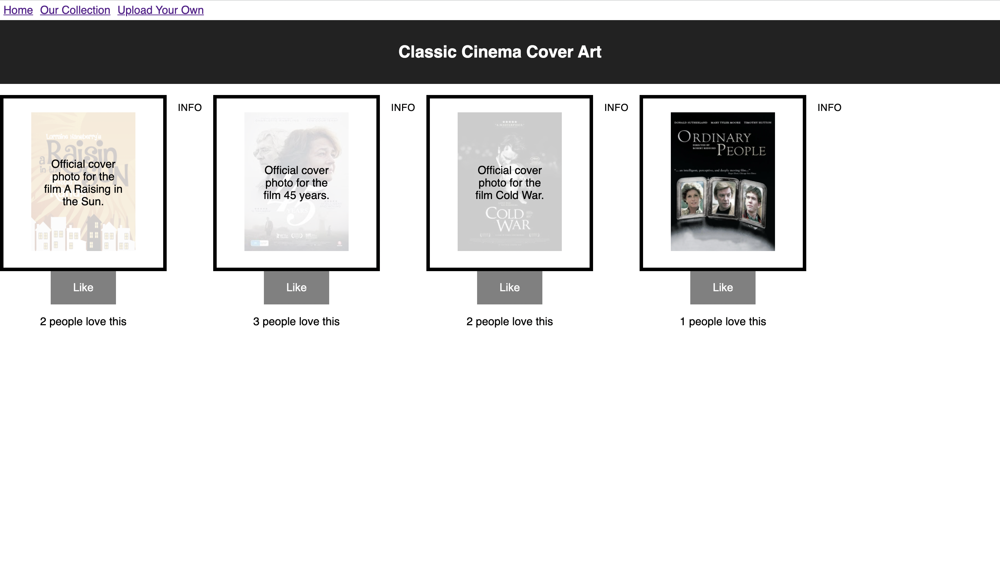
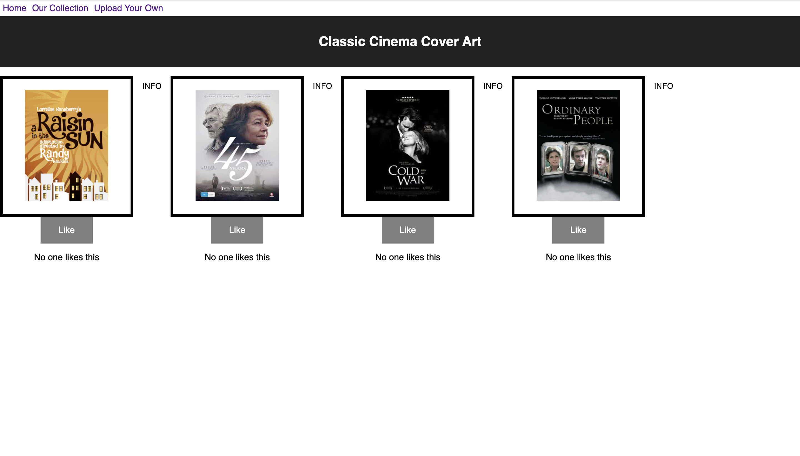
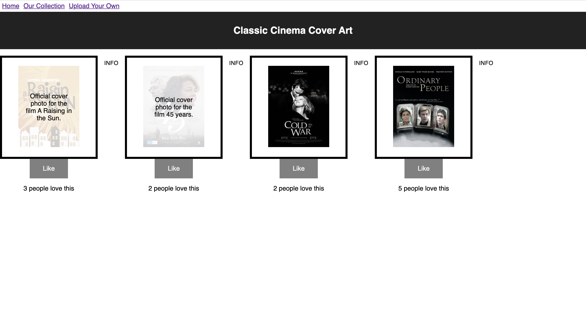
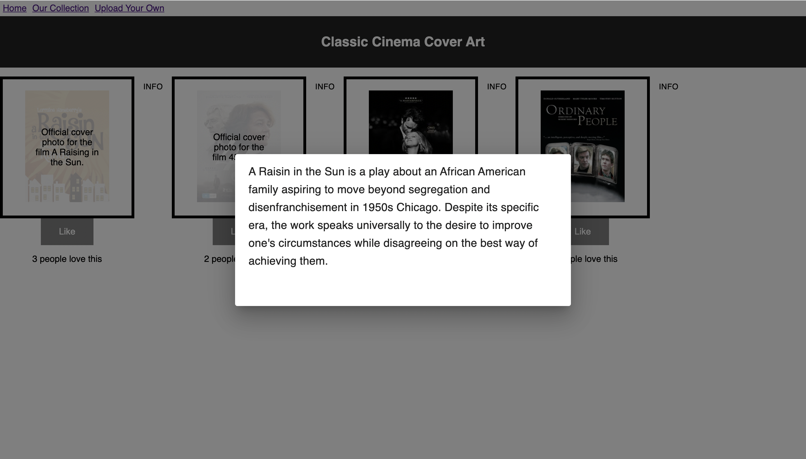

# Gallery List

[Project Instructions](./INSTRUCTIONS.md), this line may be removed once you have updated the README.md

## Learning

This project was the first time I worked with react on this scale. It forced me to think in a completely different way than I have been since working with jQuery. Concepts like state management are drastically different than what I've learned working with jQuery. Instead of dealing with DOM directly working with the virtual DOM through JSX it was hard to conceptualize just how that made the UI more efficient. However working on this project helped solidify that concept. 

## Description 

This App allows a user to add, movies on to the DOM using React's virtual DOM. Using HTTP routes the user can send movies to the sql database, they can return movies from the database, update and delete movies in the database.  The user can interact with the DOM by liking the movies, below the poster is a counter that calculates the amount of people who liked the photo.

## Screenshots

## Prerequisites
--NODE.JS
--POSTGRESQL
--POSTICO
--POSTMAN

## Built with
1.CSS
2.JAVASCRIPT
3.REACT.JS
4.POSTGRESQL
5.NODE.JS
6.MATERIAL UI
